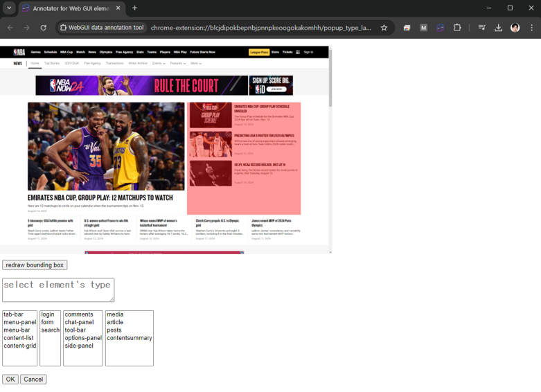
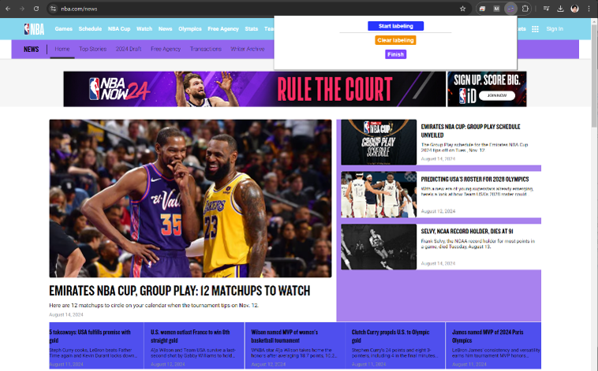
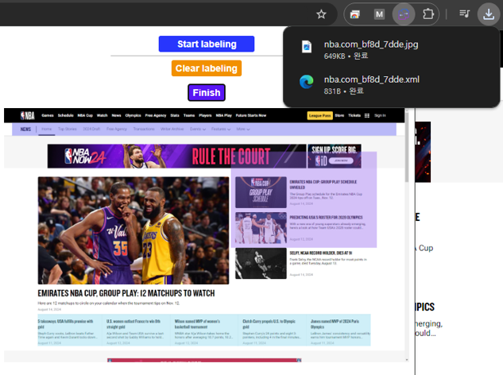

# Webpage GUI Annotation Tool
An easy-to-use tool for labeling the exact bounding boxes of web page elements

#### Features
- Chrome extension program: Supports web GUI labeling directly on a web browser
- Intuitive selection mechanism
  - Selects DOM elements by hovering and clicking via the mouse
  - Hierarchical traversal of elements using click-and-scroll
- Widely-used object detection annotation format: Saves annotations in the PASCAL VOC format (.xml)

#### How to Use
0. Download the repository
1. Go to chrome://extensions/ and enable Developer mode
2. Click on Load unpacked and select the webpage-GUI-annotation-tool folder
3. Open the web page you want to annotate and click on the extension icon to 'start labeling'
4. Select the element you want to label by hovering and clicking
5. Fill in the class name and click on the Save button from the popup window
6. Repeat 4-5 for other elements
7. Click on the extension icon to 'Finish' and it will download the image and annotation files

#### Example

| Step 1: Select web page to annotate | Step 2: Select element using mouse |
|--------|--------|
|  |  |
| **Step 3: Select type** | **Step 4 (optional): Redraw bounding box** |
|  |  |
| **Step 5: Check the annotation process** | **Step 6: Finish to download annotation and screenshot** |
|  |  |
